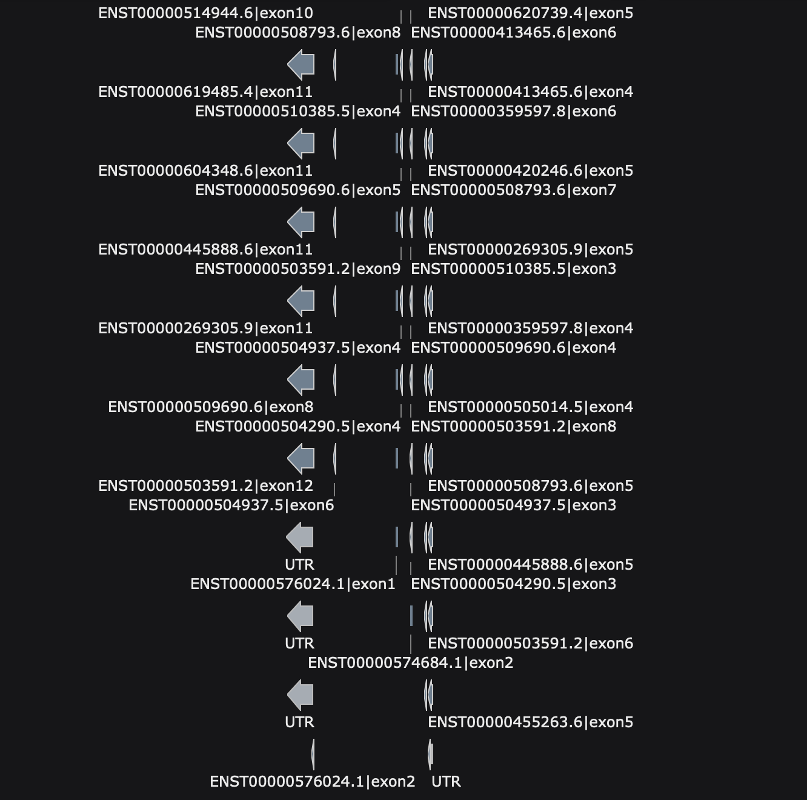
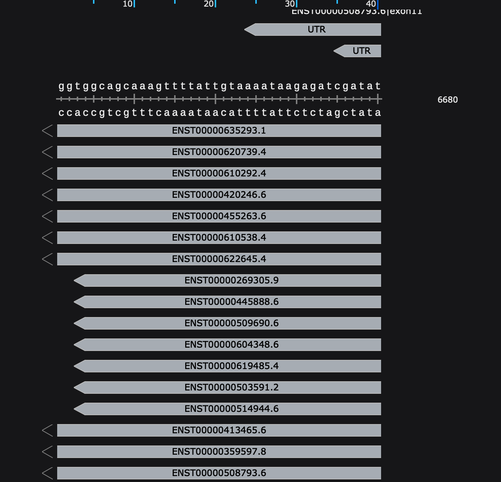

# gtf2genbank

This repository contains a small personal utility to convert GTF annotations and reference genome FASTA into GenBank (`.gbk`) files that can be opened in **SnapGene Viewer (free version)**.  
It was created mainly for my own record-keeping and visualization needs, but I decided to share it since others might find it useful as well.

These scripts are **not optimized for production use**, and functionality may be limited.  
Please use them **at your own risk! :)**

## Why?

- Quickly **visualize transcript isoform structures** (exons, optional UTRs)  
- **Compare different transcripts of a gene** by eye  
- **Assist primer design** by clearly seeing exon boundaries and untranslated regions  

### Example screenshots

  
*Differences between transcript isoforms*

  
*Detailed exon/UTR structures*

## Usage

```bash
# Gene symbol
./gtf2genbank.sh -g TP53 -a gencode.v44.annotation.gtf -f GRCh38.fa

# ENSG ID (version ignored)
./gtf2genbank.sh --ensg ENSG00000141510 -a gencode.v44.annotation.gtf -f GRCh38.fa

# ENST ID (version ignored)
./gtf2genbank.sh --enst ENST00000413465 -a gencode.v44.annotation.gtf -f GRCh38.fa

# Add UTR features
./gtf2genbank.sh -g TP53 -a gencode.v44.annotation.gtf -f GRCh38.fa -u
```

Output files (in `./snapgene_<LABEL>/`):
- `<LABEL>.gbk` (open in SnapGene Viewer)
- `<LABEL>.locus.fa`
- `<LABEL>.snapgene.gff3`

## License

MIT License. This tool is provided as-is, without any warranty.
